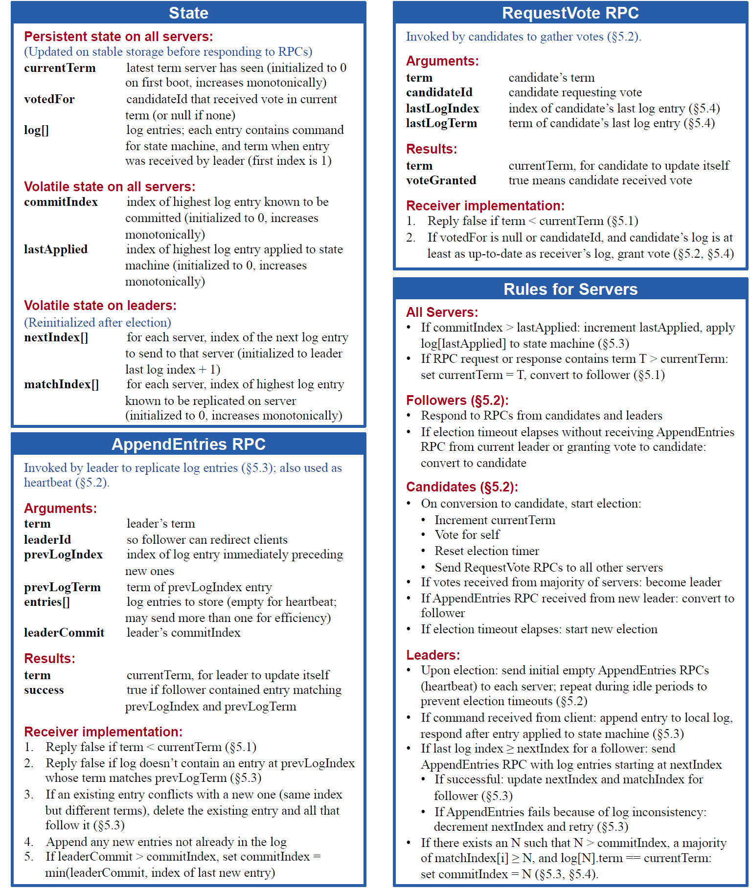

### State
#### 所有服务器 - 持久化状态
发起RPC回复前持久化
- **currentTerm** 最近server看到的term （0开始，单调增）
- **voteFor** 当前term下被推举的candidate Id
- **log[]** log entries （记录条目）。每个entry包含状态机指令，和收到leader发出的entry时的term（起始值为1）

#### 所有服务器 - 可变状态
- **commitIndex**